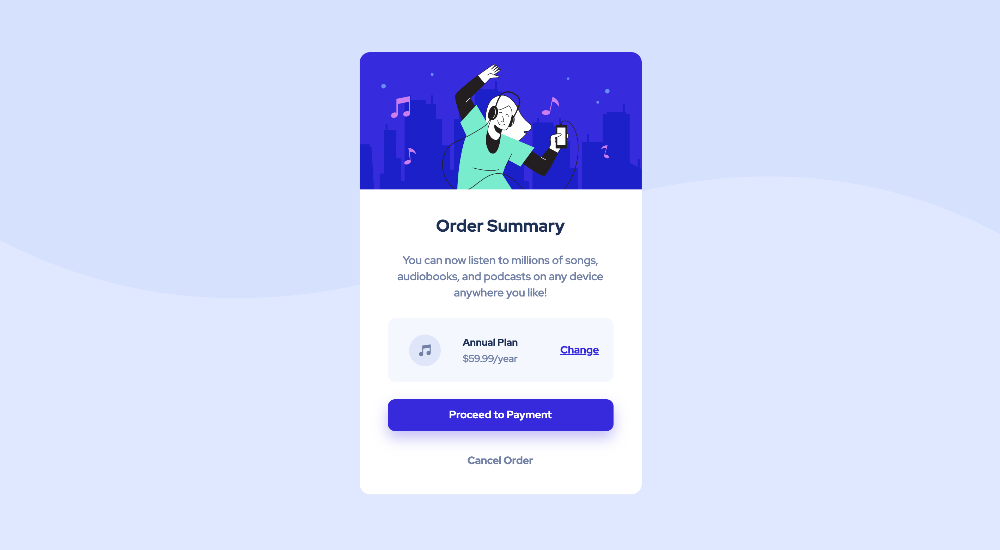

# Order summary card component
This is a solution to the [Order summary card challenge on Frontend Mentor](https://www.frontendmentor.io/challenges/order-summary-component-QlPmajDUj).

## Table of contents

- [Overview](#overview)
  - [Screenshot](#screenshot)
  - [Links](#links)
- [My process](#my-process)
  - [Built with](#built-with)
  - [What I learned](#what-i-learned)
  - [Useful resources](#useful-resources)
- [Author](#author)

## Overview

### Screenshot

### Links

- Live Site URL: [Website](https://rachanahegde.github.io/order-summary-component/index.html)

## My process

### Built with

- Semantic HTML5 markup
- CSS custom properties
- CSS Grid
– Media Queries

### What I learned

This was my first attempt at using CSS grid to build my own project and I applied what I learned from Wes Bos's CSS Grid course. I initially struggled with centering/aligning items both horizontally and vertically. However, with a great deal of googling and trial and error, I was able to understand CSS grid better. Through this project, I also learned more about z-index, styling and aligning background images, and styling buttons (especially active states and box shadow).

### Useful resources

- [CSS Grid](https://cssgrid.io/) - This course taught me everything I know about CSS Grid and I highly recommend it. 
- [Stack Overflow Explanation on Aligning Items vs Content](https://stackoverflow.com/questions/40740553/what-is-the-difference-between-align-items-vs-align-content-in-grid-layout) - This was a game changer for me because it helped me finally understand when to use align items vs align content and how grid works in different situations.
– [CSS Resets](https://learn.shayhowe.com/html-css/building-your-first-web-page/#using-css-resets) – I used this explanation of CSS resets to guide me.

## Author

- Website - [Rachana Hegde](http://rachanahegde.squarespace.com/)
- Frontend Mentor - [@rachanahegde](https://www.frontendmentor.io/profile/rachanahegde)
- Twitter - [@Rachana__H](https://twitter.com/Rachana__H)
